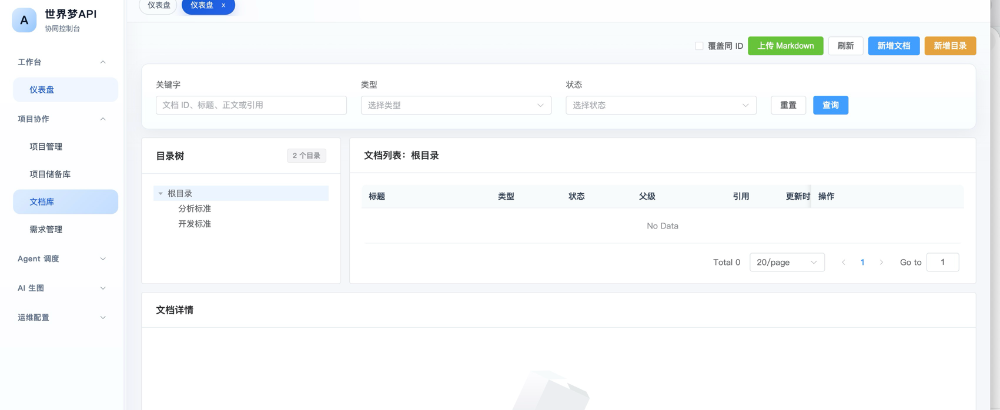
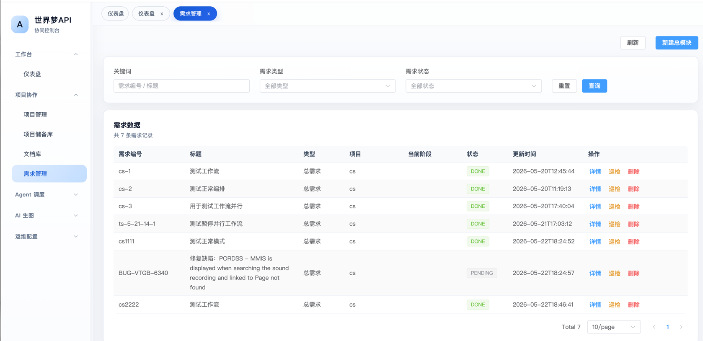
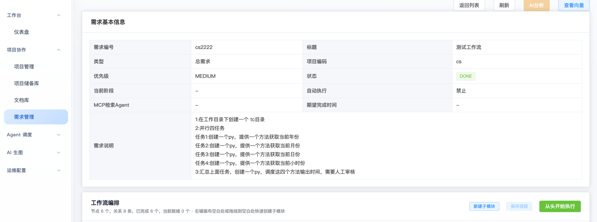
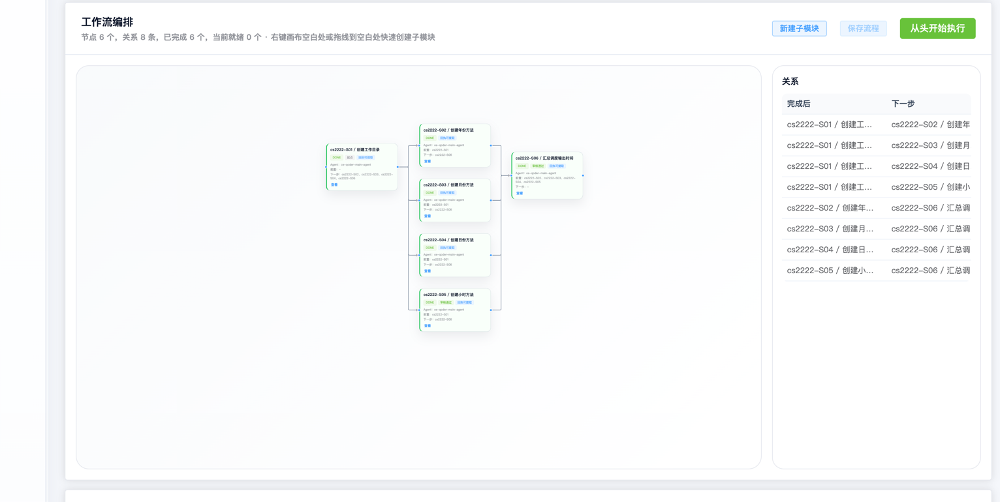
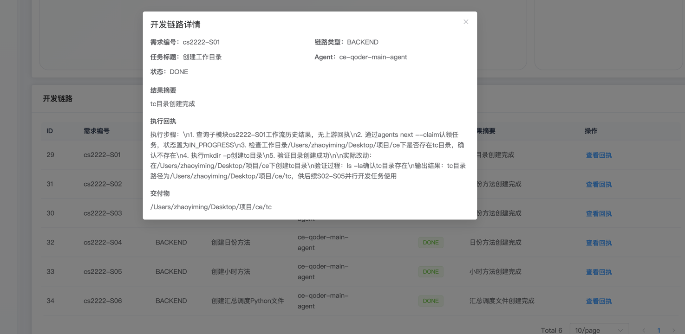

# AI API

AI API 是一个面向项目研发协作的 AI 编排系统。系统由 Vue 前端、Java 后端、Python 本机客户端和向量服务组成，用于管理项目、Agent、需求拆分、工作流执行、缺陷分析、AI 日志和项目知识库。

你还在为项目管理、Agent 管理、需求拆分、工作流执行、缺陷分析、AI 日志和项目知识库而烦恼吗？AI API 是一个面向项目研发协作的 AI 编排系统。系统由 Vue 前端、Java 后端、Python 本机客户端和向量服务组成，用于管理项目、Agent、需求拆分、工作流执行、缺陷分析、AI 日志和项目知识库。

## 系统架构

```text
Vue 前端
  |
  | HTTP API / WebSocket
  v
Java 后端
  |
  | WebSocket 命令 / 心跳 / 执行回传
  v
Python 客户端
  |
  | 调用本地 Codex / Qoder / Claude / MCP / 文件系统
  v
本地 Agent 工作目录

Java 后端
  |
  | HTTP API
  v
向量服务
  |
  | Milvus Lite / Milvus
  v
项目知识向量库
```

核心职责：

- Vue 前端：提供项目、Agent、需求、工作流、缺陷、日志、知识库等页面操作入口。
- Java 后端：作为业务编排中心，维护业务数据、调度客户端、调用 AI API、同步状态并访问向量服务。
- Python 客户端：运行在实际工作目录所在机器上，注册本机 Agent，接收后端命令并调用本地 CLI/ACP/MCP 工具执行任务。
- 向量服务：负责项目知识向量的写入、检索和删除，默认使用 Milvus Lite 本地文件库。

更完整的流程说明见 [系统架构流程说明.md](系统架构流程说明.md)。

## 项目亮点

- 多 Agent 协同编排：支持按项目、需求和子模块绑定不同 Agent，通过后端统一调度本机客户端执行任务。
- 工作流自动推进：需求可拆分为多个子模块节点，按依赖关系、审核状态和会话空闲情况自动判断可执行任务。
- 本机执行闭环：Python 客户端运行在真实工作目录，接收后端命令后调用 Codex、Qoder、Claude 或自定义 CLI，并把执行过程和结果回传。
- 规范上下文动态注入：可按项目、需求、Agent 和执行场景动态注入编码规范、接口文档、设计说明和项目知识，减少在 Prompt 中反复复制和维护 Markdown 的成本。
- AI 分析留痕：需求拆分、缺陷分析、知识整理等 AI 调用会记录请求、响应、错误和业务结果，便于追踪和复盘。
- 项目知识向量库：支持把执行回执和项目经验整理成储备知识，按项目隔离写入向量库，并在后续需求执行中检索复用。
- 实时状态同步：客户端心跳、任务执行、会话事件和工作流进度统一回到 Java 后端，再推送给前端页面展示。
- 可替换基础设施：向量服务默认使用 Milvus Lite，后续可切换独立 Milvus；Agent 执行命令也可按本机环境扩展。

## 界面预览

### 主界面



### 任务编排



### 任务调度







## 技术栈

- 后端：Java 17、Spring Boot 3.3、Spring Data JPA、Flyway、MySQL、WebSocket
- 前端：Vue 3、Vite、TypeScript、Element Plus、Pinia、Vue Router
- 本机客户端：Python 3.10+
- 向量服务：Python、FastAPI、Milvus Lite / Milvus

## 目录结构

```text
.
├── src/                     # Java 后端源码和 Flyway 数据库脚本
├── frontend/                # Vue 前端
├── python-client/           # 本机 Agent 执行客户端
├── milvusClient/            # 向量服务
├── public/                  # README 使用的界面截图
├── skills/                  # Agent 执行时使用的技能脚本
├── md文件汇总/              # 需求、接口和设计文档
└── 系统架构流程说明.md       # 四个服务的协作流程说明
```

## 部署准备

需要提前安装：

- JDK 17+
- Maven 3.8+
- Node.js 18+
- Python 3.10+
- MySQL 8.x

创建数据库：

```sql
CREATE DATABASE `ai-api` DEFAULT CHARACTER SET utf8mb4 COLLATE utf8mb4_unicode_ci;
```

后端启动时会通过 Flyway 自动执行 `src/main/resources/db/migration` 下的数据库迁移脚本。

## 后端部署

后端默认端口是 `8080`，数据库和向量服务地址通过环境变量配置：

```bash
export DB_URL='jdbc:mysql://127.0.0.1:3306/ai-api?useUnicode=true&characterEncoding=utf8&serverTimezone=Asia/Shanghai'
export DB_USERNAME='root'
export DB_PASSWORD='你的数据库密码'
export SERVER_PORT=8080
export AI_KNOWLEDGE_VECTOR_BASE_URL='http://127.0.0.1:8091'
```

开发启动：

```bash
mvn spring-boot:run
```

生产打包：

```bash
mvn clean package
java -jar target/ai-api-0.0.1-SNAPSHOT.jar
```

接口文档地址：

```text
http://127.0.0.1:8080/swagger-ui.html
```

## 向量服务部署

向量服务默认监听 `8091`，默认使用 `state/milvus-lite/ai_api.db` 作为本地 Milvus Lite 数据文件。

```bash
python3 -m venv .venv
. .venv/bin/activate
pip install -r milvusClient/requirements.txt
python3 milvusClient/app.py
```

如需连接独立 Milvus 服务：

```bash
export MILVUS_URI='http://127.0.0.1:19530'
python3 milvusClient/app.py
```

## 前端部署

开发启动：

```bash
cd frontend
npm install
npm run dev
```

Vite 开发服务默认访问：

```text
http://127.0.0.1:5173
```

开发环境已在 `frontend/vite.config.ts` 中代理：

- `/api` -> `http://localhost:8080`
- `/ws` -> `ws://localhost:8080`

生产构建：

```bash
cd frontend
npm install
npm run build
```

构建产物在 `frontend/dist`，可交给 Nginx 等静态服务部署，并将 `/api`、`/ws` 反向代理到 Java 后端。

## Python 客户端部署

Python 客户端用于在本机工作目录执行 Agent 任务。先复制配置：

```bash
cp python-client/client-config.example.json python-client/client-config.json
```

编辑 `python-client/client-config.json`：

- `server.host`、`server.port` 指向 Java 后端。
- `agents[].agent_code` 必须是后端 Agent 管理中已经存在的 Agent 编号。
- `agents[].workspace_dir` 指向本机实际项目目录。
- `agents[].worker_command` 填写本机可用的执行命令，例如 `codex`、`qoder` 或其他自定义命令。

启动客户端：

```bash
PYTHONPATH=python-client python3 -m ai_api_client --use-client-config
```

客户端启动后会注册到后端，页面上可以在“在线客户端”和 Agent 相关页面看到在线状态。

## 标准技能

项目内置四个标准技能，位于 `skills/` 目录。它们用于把 Agent 会话和 ai-api 后端、项目规范、项目 Markdown、项目知识库连接起来。

| 技能 | 作用 | 典型使用场景 |
| --- | --- | --- |
| `ai-api-agent-integration` | ai-api 协作中台接入技能 | 查询项目、Agent、需求、子任务、链路、会话，并回写任务执行结果 |
| `project-markdown-workspace` | 项目 Markdown 工作区技能 | 将服务端 Markdown 配置同步到本地 `md-files`，或把本地 Markdown 回传到服务端 |
| `project-development-documents` | 项目开发文档上下文技能 | 按项目和 Agent 角色动态读取通用规范、开发规范、测试规范、运维规范等上下文 |
| `project-knowledge-language-search` | 项目知识库自然语言检索技能 | 通过 MCP SSE 或 HTTP 接口检索项目储备知识和相似经验 |

### 关键配置

`ai-api-agent-integration` 负责连接 ai-api 任务协作能力，关键配置是工作目录、项目、Agent 和后端地址：

```json
{
  "workspaces": [
    {
      "workspaceDir": "/absolute/path/to/workspace",
      "projectCode": "ai-api",
      "agentCode": "ce-main-agent",
      "agentName": "CE Main Agent",
      "agentEngineType": "CODEX",
      "agentRole": "DEVELOPER",
      "baseUrl": "http://localhost:8080"
    }
  ]
}
```

配置文件：`skills/ai-api-agent-integration/skill-config.json`

`project-markdown-workspace` 负责把服务端项目 Markdown 配置同步到本地工作区，关键配置是工作目录、项目、Agent 角色和后端地址：

```json
{
  "workspaces": [
    {
      "workspaceDir": "/absolute/path/to/workspace",
      "projectCode": "ai-api",
      "agentRole": "DEVELOPER",
      "url": "http://localhost:8080"
    }
  ]
}
```

配置文件：`skills/project-markdown-workspace/skill-config.json`

`project-development-documents` 负责按项目和 Agent 角色读取规范上下文，关键配置是工作目录、项目、Agent 角色和后端地址：

```json
{
  "workspaces": [
    {
      "workspaceDir": "/absolute/path/to/workspace",
      "projectCode": "ai-api",
      "agentRole": "DEVELOPER",
      "url": "http://localhost:8080"
    }
  ]
}
```

配置文件：`skills/project-development-documents/skill-config.json`

`project-knowledge-language-search` 负责检索项目储备知识，关键配置是后端地址：

```json
{
  "url": "http://127.0.0.1:8080"
}
```

配置文件：`skills/project-knowledge-language-search/skill-config.json`

如果 Agent 支持 MCP SSE，可以额外配置项目知识库 MCP：

```json
{
  "mcpServers": {
    "ai-api-project-knowledge": {
      "type": "sse",
      "url": "http://127.0.0.1:8080/api/mcp/project-knowledge/sse"
    }
  }
}
```

最关键的是保持 `workspaceDir` 指向实际工作目录，`projectCode` 和 `agentCode` 与后端页面中的配置一致，`agentRole` 与该 Agent 的职责一致，`baseUrl` / `url` 指向 Java 后端地址。

配置项说明：

| 配置项 | 适用技能 | 说明 |
| --- | --- | --- |
| `workspaces` | 前三个技能 | 工作区配置列表。一个技能可以配置多个工作目录，运行时会按当前目录匹配最合适的一项。 |
| `workspaceDir` | 前三个技能 | 本机 Agent 工作目录，必须使用绝对路径。 |
| `projectCode` | 前三个技能 | 后端项目编码，需要与项目管理页面中的项目编码一致。 |
| `agentCode` | `ai-api-agent-integration` | 后端 Agent 编号，需要与 Agent 管理页面中的编号一致。 |
| `agentName` | `ai-api-agent-integration` | Agent 展示名称，用于初始化或对齐 Agent 信息。 |
| `agentEngineType` | `ai-api-agent-integration` | Agent 执行引擎，可选 `CODEX`、`QODER`、`CLAUDE`。 |
| `agentRole` | 前三个技能 | Agent 角色，可选 `MAIN`、`DEVELOPER`、`TESTER`、`OPS`、`REVIEWER`。 |
| `baseUrl` | `ai-api-agent-integration` | Java 后端地址，例如 `http://localhost:8080`。 |
| `url` | 其他三个技能 | Java 后端地址，例如 `http://localhost:8080` 或 `http://127.0.0.1:8080`。 |
| `mcpServers.ai-api-project-knowledge.type` | MCP 配置 | MCP 传输类型，当前使用 `sse`。 |
| `mcpServers.ai-api-project-knowledge.url` | MCP 配置 | 项目知识库 MCP SSE 地址，格式为 `{后端地址}/api/mcp/project-knowledge/sse`。 |

## 常用启动顺序

1. 启动 MySQL。
2. 启动向量服务：`python3 milvusClient/app.py`。
3. 启动 Java 后端：`mvn spring-boot:run`。
4. 启动 Vue 前端：`cd frontend && npm run dev`。
5. 启动 Python 客户端：`PYTHONPATH=python-client python3 -m ai_api_client --use-client-config`。
6. 在前端配置项目、Agent、AI 模型参数，再创建需求并下发执行。

## 配置说明

常用环境变量：

| 变量 | 默认值 | 说明 |
| --- | --- | --- |
| `SERVER_PORT` | `8080` | Java 后端端口 |
| `DB_URL` | 本地 `ai-api` MySQL | 数据库 JDBC 地址 |
| `DB_USERNAME` | `root` | 数据库用户名 |
| `DB_PASSWORD` | 空 | 数据库密码 |
| `AI_KNOWLEDGE_VECTOR_BASE_URL` | `http://127.0.0.1:8091` | 向量服务地址 |
| `AI_IMAGE_STORAGE_DIR` | `./state/ai-images` | 图片生成文件存储目录 |
| `AI_IMAGE_RESPONSE_STORAGE_DIR` | `./state/ai-image-responses` | 图片生成响应记录目录 |

AI 模型 API Key、图片模型配置、缺陷平台账号等业务配置建议在系统页面中维护，不要写入代码仓库。

